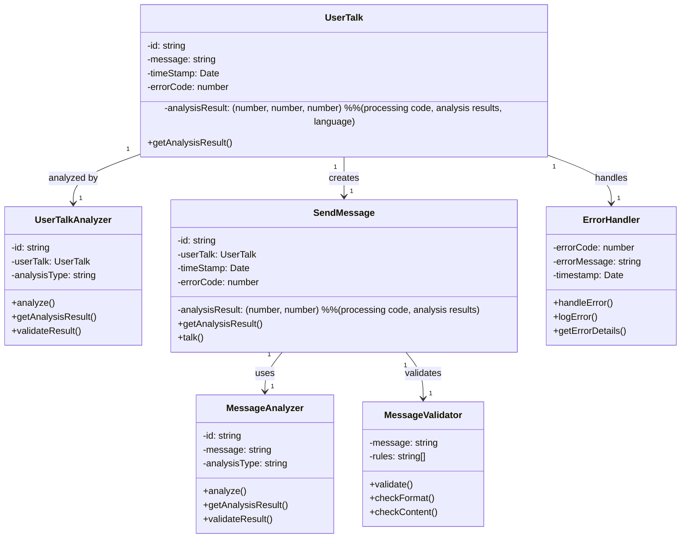

# Class Diagram

```mermaid
classDiagram
    class UserTalk {
        -id: string
        -message: string
        -timeStamp: Date
        -errorCode: number
        -analysisResult: (number, number, number) %% (processing code, analysis results, language)
        +getAnalysisResult()
    }
    
    class UserTalkAnalyzer {
        -id: string
        -userTalk: UserTalk
        -analysisType: string
        +analyze()
        +getAnalysisResult()
        +validateResult()
    }
    
    class SendMessage {
        -id: string
        -userTalk: UserTalk
        -timeStamp: Date
        -errorCode: number
        -analysisResult: (number, number) %% (processing code, analysis results)
        +getAnalysisResult()
        +talk()
    }
    
    class MessageAnalyzer {
        -id: string
        -message: string
        -analysisType: string
        +analyze()
        +getAnalysisResult()
        +validateResult()
    }
    
    class ErrorHandler {
        -errorCode: number
        -errorMessage: string
        -timestamp: Date
        +handleError()
        +logError()
        +getErrorDetails()
    }
    
    class MessageValidator {
        -message: string
        -rules: string[]
        +validate()
        +checkFormat()
        +checkContent()
    }
    
    UserTalk "1" --> "1" UserTalkAnalyzer : analyzed by
    UserTalk "1" --> "1" SendMessage : creates
    SendMessage "1" --> "1" MessageAnalyzer : uses
    UserTalk "1" --> "1" ErrorHandler : handles
    SendMessage "1" --> "1" MessageValidator : validates
```
