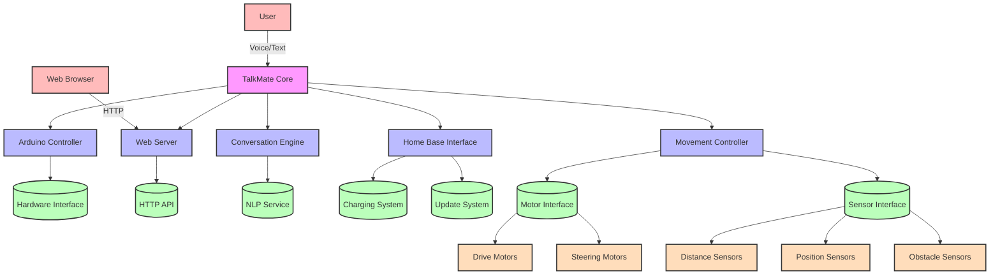

# Component Diagram

```mermaid
graph TB
    %% Main Components
    A[TalkMate Core] --> B[Arduino Controller]
    A --> C[Web Server]
    A --> D[Conversation Engine]
    A --> E[Home Base Interface]
    A --> M[Movement Controller]
    
    %% Sub Components
    B --> F[(Hardware Interface)]
    C --> G[(HTTP API)]
    D --> H[(NLP Service)]
    E --> I[(Charging System)]
    E --> J[(Update System)]
    
    %% Movement Related Components
    M --> N[(Motor Interface)]
    M --> O[(Sensor Interface)]
    N --> P[Drive Motors]
    N --> Q[Steering Motors]
    O --> R[Distance Sensors]
    O --> S[Position Sensors]
    O --> T[Obstacle Sensors]
    
    %% External Systems
    K[Web Browser] -- "HTTP" --> C
    L[User] -- "Voice/Text" --> A
    
    %% Style Definitions
    classDef core fill:#f9f,stroke:#333,stroke-width:2px;
    classDef component fill:#bbf,stroke:#333,stroke-width:2px;
    classDef interface fill:#bfb,stroke:#333,stroke-width:2px;
    classDef external fill:#fbb,stroke:#333,stroke-width:2px;
    classDef hardware fill:#fdb,stroke:#333,stroke-width:2px;
    
    %% Style Applications
    class A core;
    class B,C,D,E,M component;
    class F,G,H,I,J,N,O interface;
    class K,L external;
    class P,Q,R,S,T hardware;
```
