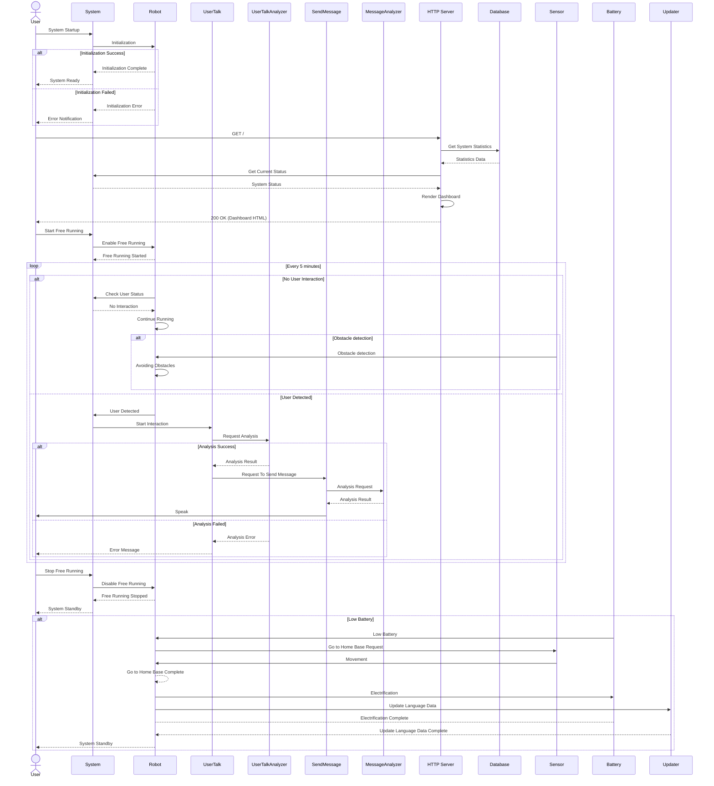

# Sequence Diagram

```mermaid
sequenceDiagram
    actor U as User
    participant S as System
    participant R as Robot
    participant UT as UserTalk
    participant UTA as UserTalkAnalyzer
    participant SM as SendMessage
    participant MA as MessageAnalyzer
    participant H as HTTP Server
    participant DB as Database
    participant SE as Sensor
    participant B as Battery
    participant UP as Updater

    %% System startup and initialization
    U->>S: System Startup
    S->>R: Initialization
    alt Initialization Success
        R-->>S: Initialization Complete
        S-->>U: System Ready
    else Initialization Failed
        R-->>S: Initialization Error
        S-->>U: Error Notification
    end
    
    %% Dashboard Access
    U->>H: GET /
    H->>DB: Get System Statistics
    DB-->>H: Statistics Data
    H->>S: Get Current Status
    S-->>H: System Status
    H->>H: Render Dashboard
    H-->>U: 200 OK (Dashboard HTML)
    
    %% free-running mode
    U->>S: Start Free Running
    S->>R: Enable Free Running
    R-->>S: Free Running Started
    
    loop Every 5 minutes
        alt No User Interaction
            R->>S: Check User Status
            S-->>R: No Interaction
            R->>R: Continue Running
            alt Obstacle detection
                SE->>R: Obstacle detection
                R->>R: Avoiding Obstacles
            end
        else User Detected
            R->>S: User Detected
            S->>UT: Start Interaction
            UT->>UTA: Request Analysis
            alt Analysis Success
                UTA-->>UT: Analysis Result
                UT->>SM: Request To Send Message
                SM->>MA: Analysis Request
                MA-->>SM: Analysis Result
                SM->>U: Speak
            else Analysis Failed
                UTA-->>UT: Analysis Error
                UT-->>U: Error Message
            end
        end
    end

    %% End of free running
    U->>S: Stop Free Running
    S->>R: Disable Free Running
    R-->>S: Free Running Stopped
    S-->>U: System Standby

    %% Go to Home base
    alt Low Battery
        B->>R: Low Battery
        R->>SE: Go to Home Base Request
        SE->>R: Movement
        R-->>R: Go to Home Base Complete
        R->>B: Electrification
        R->>UP: Update Language Data
        B-->R: Electrification Complete
        UP-->>R: Update Language Data Complete
        R-->>U: System Standby
    end
```
