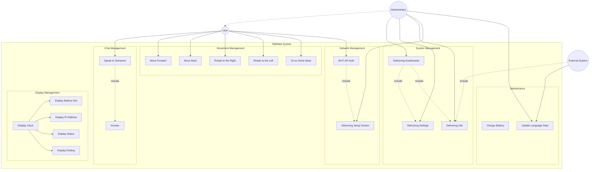

# Use Case Diagram

```mermaid
flowchart TB
    %% Actors
    User((User))
    Admin((Administrator))
    ExternalSystem((External System))
    Admin -.-> User

    %% System Boundary
    subgraph System[TalkMate System]
        %% Chat Management
        subgraph Chat[Chat Management]
            SpeakToSomeone[Speak to Someone]
            Answer[Answer]
        end

        %% Movement Management
        subgraph Move[Movement Management]
            MoveForward[Move Forward]
            MoveBack[Move Back]
            RotateToTheRight[Rotate to the Right]
            RotateToTheLeft[Rotate to the Left]
            GoToHomeBase[Go to Home Base]
        end

        %% System Management
        subgraph HttpServer[System Management]
            DeliveringDashboards[Delivering Dashboards]
            DeliveringSettings[Delivering Settings]
            DeliveringInfo[Delivering Info]
        end

        %% Network Management
        subgraph WifiAP[Network Management]
            WifiAPAuth[Wi-Fi AP Auth]
            DeliveringSetupScreen[Delivering Setup Screen]
        end

        %% Maintenance
        subgraph HomeBase[Maintenance]
            ChargeBattery[Charge Battery]
            UpdateLanguageData[Update Language Data]
        end

        %% Display Management
        subgraph Display[Display Management]
            DisplayClock[Display Clock]
            DisplayBatteryInfo[Display Battery Info]
            DisplayIpAddress[Display IP Address]
            DisplayStatus[Display Status]
            DisplayFeeling[Display Feeling]
        end
    end

    %% User Relationships
    User --> SpeakToSomeone
    User --> MoveForward
    User --> MoveBack
    User --> RotateToTheRight
    User --> RotateToTheLeft
    User --> GoToHomeBase
    User --> WifiAPAuth

    %% Admin Relationships
    Admin --> DeliveringDashboards
    Admin --> DeliveringSettings
    Admin --> DeliveringInfo
    Admin --> DeliveringSetupScreen
    Admin --> UpdateLanguageData

    %% External System Relationships
    ExternalSystem --> UpdateLanguageData
    ExternalSystem -.->|include| DeliveringInfo

    %% Include Relationships
    SpeakToSomeone -.->|include| Answer
    WifiAPAuth -.->|include| DeliveringSetupScreen
    DeliveringDashboards -.->|include| DeliveringSettings
    DeliveringDashboards -.->|include| DeliveringInfo

    %% Display Relationships
    DisplayClock --> DisplayBatteryInfo
    DisplayClock --> DisplayIpAddress
    DisplayClock --> DisplayStatus
    DisplayClock --> DisplayFeeling
```
